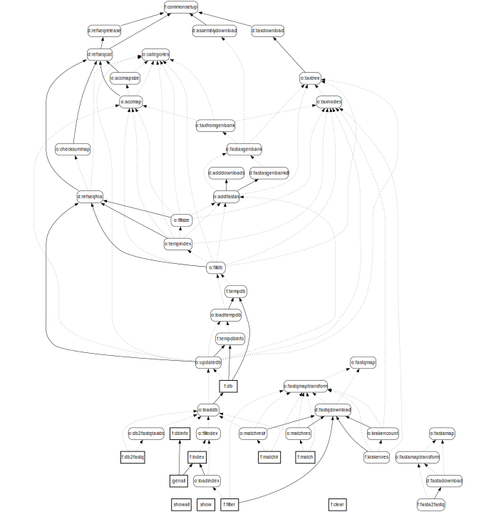

[comment]: # (“Commons Clause” License Condition v1.0)
[comment]: # ()  
[comment]: # (The Software is provided to you by the Licensor under the License,)
[comment]: # (as defined below, subject to the following condition.)
[comment]: # ()  
[comment]: # (Without limiting other conditions in the License, the grant of rights under the License)
[comment]: # (will not include, and the License does not grant to you, the right to Sell the Software.)
[comment]: # ()
[comment]: # (For purposes of the foregoing, “Sell” means practicing any or all of the rights granted)
[comment]: # (to you under the License to provide to third parties, for a fee or other consideration)
[comment]: # (including without limitation fees for hosting or consulting/ support services related to)
[comment]: # (the Software, a product or service whose value derives, entirely or substantially, from the)
[comment]: # (functionality of the Software. Any license notice or attribution required by the License)
[comment]: # (must also include this Commons Clause License Condition notice.)
[comment]: # ()
[comment]: # (Software: genestrip)
[comment]: # ()
[comment]: # (License: Apache 2.0)
[comment]: # ()
[comment]: # (Licensor: Daniel Pfeifer, daniel.pfeifer@progotec.de)

**Genestrip**: Efficient read classification, filtering and *k*-mer counting for selected groups of species 
===============================================

## Introduction

Metagenomic analysis has become an extremely import field in bio informatics. To analyse large sets of reads, researchers use highly efficient software tools based on *k*-mer matching and counting such as [Kraken](https://github.com/DerrickWood/kraken), [Kraken 2](https://github.com/DerrickWood/kraken2) or [KrakenUniq](https://github.com/fbreitwieser/krakenuniq). With regard to pathogen detection [KrakenUniq](https://github.com/fbreitwieser/krakenuniq) is particularly suited because of its
 [very low false positive rate](https://genomebiology.biomedcentral.com/articles/10.1186/s13059-018-1568-0) but also because its efficiency, precision and sensitivity.

To avoid false positive classifications of reads or mismatches of *k*-mers, all of these tools resort to very large databases, containing millions of encoded *k*-mers along with their respective tax ids. A database is usually loaded entirely into main memory and consumes tens of gigabytes of space. This requirement mandates specialized and expensive compute servers with very large main memory.

If only a small group of a few dozen species or strains is to be considered, one could simply *generate a smaller database that contains just the *k*-mers of the respective genomes*. **However, when done improperly, this may lead to many false positives at read analysis time.** The reason for this is that due to the evolutionary relationship of organisms, *a large fraction of k-mers that belong to the genome of a species are unspecific* in a sense that they can as well be found in the genome other species not considered for analysis.

Genestrip offers an efficient and sophisticated database generation process that accounts for this problem: 
* Genstrips's databases can be generated in a fully automated way on the basis of the [RefSeq](https://ftp.ncbi.nlm.nih.gov/refseq/release/). On top, genomic files from [Genbank](https://ftp.ncbi.nlm.nih.gov/genomes/genbank/) can be automatically included for the selected group of species or strains. Including such files may refine the database by adding species-related *k*-mers not found in the RefSeq alone.
* Species or strains, whose *k*-mers should be contained, are specified via a text file containing the corresponding [tax ids](https://ftp.ncbi.nlm.nih.gov/pub/taxonomy/). 
* After the database generation has completed, it can be used for highly efficient *k*-mer matching.
* As a Genestrip database comprises just the genomes of the specified tax ids, it tends to remain small. Therefore analysis can be performed on edge machines as well as on small sized PCs.
* Much like KrakenUniq, Genestrip supports (exact) unique *k*-mer counting and total *k*-mer counting. Related results are stored in a CSV file. 
* Moreover, a fastq file can be *filtered* via the *k*-mers of a database to reduce the size of the file considerably. Still, all reads containing *k*-mers of the selected tax ids will be kept in the filtered fastq file. A similar functionality can be achieved via [biobloom](https://github.com/bcgsc/biobloom), but preparing and applying related filters is very convenient with Genestrip.

## License

[Genestrip is free for non-commercial use.](./LICENSE.txt) Please contact [daniel.pfeifer@progotec.de](mailto:daniel.pfeifer@progotec.de) if you are interested in a commercial license.

## Building and installing

Genestrip is structured as a standard [Maven 2 or 3](https://maven.apache.org/) project and is compatible with the [JDK](https://jdk.java.net/) 1.8 or higher.[^1]

To build it, `cd` to the installation directory `genestrip`. Given a matching Maven and JDK installation, `mvn install` will compile, test and install the Genestrip program library. Afterwards a self-contained and executable `genestrip.jar` file will be stored under `./lib`. 

Since version 0.5, Genestrip is also available on [Maven Central](https://repo1.maven.org/maven2/org/genestrip/genestrip/).
Here is the dependency:
```
<dependency>
	<groupId>org.genestrip</groupId>
	<artifactId>genestrip</artifactId>
	<version>1.1</version>
</dependency>
```
You may check for higher versions and update the dependency accordingly...

### Self-contained Windows executable

The Maven command `mvn -P winexe package` creates a self-contained Windows executable `bin/genestrip.exe` along with a reduced JRE under `lib/jre`. 
You need a [JDK](https://jdk.java.net/) 11 installation or higher on Windows for this command to succeed.
Moreover it creates a Zip folder `target/genestrip-${version}-windows-x64.zip` that contains the same files with less than 40 MB of disk space.

When extracted Genestrip can be executed via `bin\genestrip.exe` (on a Windows x86, 64 bit architecture). It will search for the above JRE for 
execution under the relative location `..\lib\jre`. So the folders `bin` and `lib` should be kept together accordingly. **These few files is all it takes to run Genestrip under Windows!** There is no additional JRE necessary.

For convenience, the ready-made Zip folder `genestrip-${version}-windows-x64.zip` is also [publicly available for download on Google Drive](https://drive.google.com/file/d/1fxI8M1I4d_W6NoapbPPv93XvZelsqA_N/view?usp=sharing).

### Runnning the JUnit tests

The Maven command `mvn -P prerelease install` runs all the JUnit tests for Genestrip and more. It will take time...

[^1]: Counter to common belief, Java can well be used for such high performance applications when using its programming facilities the right way.

## Generating the sample database

The Genestrip installation holds additional folders that include the sample project `human_virus`. After building Genestrip, you may call
`sh ./bin/genestrip.sh human_virus dbinfo`
in order to generate the `human_virus` database and create a CSV file with basic information about the database content.

Genestrip follows a goal-oriented approach in order to create any result files (in similarity to [make](https://pubs.opengroup.org/onlinepubs/9699919799/utilities/make.html)). So, when generating the `human_virus` database, Genestrip will
1. download the [taxonomy](https://ftp.ncbi.nlm.nih.gov/pub/taxonomy/taxdmp.zip) and unzip it to `./data/common`,
1. download the [RefSeq release catalog](https://ftp.ncbi.nlm.nih.gov/refseq/release/release-catalog/) to `./data/common/refseq`,
1. download [all virus related RefSeq fna files](https://ftp.ncbi.nlm.nih.gov/refseq/release/viral/) to `./data/commmon/refseq` (which is currently just a single file),
1. perform several follow-up goals, until the database file `human_virus_db.zip` is finally made under `./data/projects/human_virus/db`, 
1. create a CSV file `human_virus_dbinfo.csv` under `./data/projects/human_virus/csv`, which contains basic information about the database, i.e. the number of *k*-mers stored per tax id.

The generated database comprises *k*-mers for all viruses according to the tax id file `./data/project/human_virus/taxids.txt`.


## Generating your own database

Generating your own database is straight-forward:
1. Create a project folder `<project_name>` under `./data/projects/`. This is the place for all subsequent files that specify the content of a database to be generated. It is also the core name of a related database.
1. Create a text file `./data/projects/<project_name>/taxids.txt` with one tax id per line. The database will *only* contain *k*-mers from genomes that belong to tax ids referenced in the file `taxids.txt`. If `taxids.txt` contains a tax id from a non-leaf node of the [taxonomy](https://ftp.ncbi.nlm.nih.gov/pub/taxonomy/taxdmp.zip), then all subordinate tax ids and *k*-mers from respective [RefSeq](https://ftp.ncbi.nlm.nih.gov/refseq/release/) genomes will be included in the database as well.
1. Create a text file `./data/projects/<project_name>/categories.txt`. This file tells Genestrip, which categories of organisms should be *considered* when generating the database and when determining a least common ancestor tax id for *k*-mers in the finalized database. You also have to ensure that the categories from `categories.txt` comprise all of the tax ids from `taxids.txt`: Only genomes of comprised tax ids will be used to generate the database.
1. The following categories are allowed, and originate from the [RefSeq](https://ftp.ncbi.nlm.nih.gov/refseq/release/):
`archaea`, `bacteria`, `complete`, `fungi`, `invertebrate`, `mitochondrion`, `other`, `plant`, `plasmid`, `plastid`, `protozoa`, `vertebrate_mammalian`, `vertebrate_other` and `viral`. You may enter one category per line.
The *entire* set of genomes that belong to a category referenced in `categories.txt` will be used to determine the least common ancestors tax ids of the *k*-mers stored in the finalized database. The more categories you reference in `categories.txt`, the more genomes files will have to be downloaded from the [RefSeq](https://ftp.ncbi.nlm.nih.gov/refseq/release/) and the longer the database generation process will take. E.g., if only the category `viral` is included, it should just take a few minutes, but with `bacteria` included, it may typically take about a day or more.
So you should choose a suitable set of categories to balance completeness of considered genomes with efficiency of the database generation process.

1. Start the database generation process via the command `sh ./bin/genestrip.sh <project_name> dbinfo`. 
This will also create a CSV file `./data/projects/<project_name>/csv/<project_name>_dbinfo.csv` with 
basic information about the database, i.e. the number of *k*-mers stored per tax id. 
The path of the database will be `./data/projects/<project_name>/db/<project_name>_db.zip`. 
The database file `<project_name>_db.zip` is self-contained and includes all necessary taxonomic information for its 
later use via the goals `match` and `matchlr`.

In general, Genestrip organizes a project folder `./data/projects/<project_name>` by means of the following sub-folders:
* `csv` is where analysis results of fastq files will be stored (by default).
* `db` is where Genestrip puts the generated database. If your focus is on filtering fastq files, Genestrip can create a specialized,  filtering database named `<project_name>_index.ser.gz` that will be put there too. Moreover, the intermediate database `<project_name>_tempdb.zip` will be put there temporarily as part of the database generation process. 
* `fasta` may be used to store *additional* genome files (not part of in the [RefSeq](https://ftp.ncbi.nlm.nih.gov/refseq/release/)) that should be considered for the database generation process (see Section [Additional fasta files](#additional-fasta-files)).
* `fastq` is where Genestrip will store filtered (or generated) fastq files. You may also put you own fastq files to be analyzed there (but they can be read from any other path too).
* `genbank` is where genomic files from Genbank will be downloaded to if needed during the project's database generation process.
* `krakenout` is for output files in the style of [Kraken](https://ccb.jhu.edu/software/kraken/MANUAL.html#output-format). They may optionally be generated when analyzing fastq files.
* `log` is reserved for future use in conjunction with a server-side integration of Genestrip.

A database covering more species may require more memory - especially while generating the database. This can be addressed by adjusting the script `genestrip.sh` where the argument `-Xmx32g` sets the maximum heap space of the Java Virtual Machine to 32GB. E.g. to double it, simple replace `32g` by `64g`.

## Some preconfigured and ready-made databases

There is a separate project [Genestrip-DB](https://github.com/pfeiferd/genestrip-db) on GitHub that covers [8 databases](https://github.com/pfeiferd/genestrip-db/blob/main/README.md#the-databases) and offers a [corresponding download from Google Drive](https://drive.google.com/drive/folders/1cmMPjHTAs4pEti4eEM-gOngvOn39btdU?usp=sharing). 

## Analyzing fastq files by matching *k*-mers of reads

Genestrip's main purpose is to analyze reads from fastq files and count the contained *k*-mers per tax id according to a previously generated database. As an example, Genestrip comes with a small fastq-file `sample.fastq.gz` in `./data/projects/human_virus/fastq`. To start the matching process for it, run
```
sh ./bin/genestrip.sh -f./data/projects/human_virus/fastq/sample.fastq.gz human_virus match
```
**Beware: No blank between `-f` and the file path.**

The resulting CSV file will be named `human_virus_match_sample.csv` under `./data/projects/human_virus/csv`. The same applies to your own projects under `./data/projects`.

These are a few lines of its contents along with the header line:
```
name;rank;taxid;reads;kmers from reads;kmers;unique kmers;contigs;average contig length;max contig length;max contig desc.;normalized kmers;exp. unique kmers;unique kmers / exp.;quality prediction;
TOTAL;SUPERKINGDOM;1;6565;0;461305;0;0;0;0;0;0;0;0;0;
Viruses;SUPERKINGDOM;10239;1016;15939;27712;72;2653;10.4568;101;@NS500362:54:HT523BGX2:4:12412:20538:2021 2:N:0:2;2960.144020983948;80.0000;0.9000;2664.129618885553;
Orthornavirae;KINGDOM;2732396;19;159;122;4;119;1.2773;32;@NS500362:54:HT523BGX2:4:11405:19113:11578 2:N:0:2;260.63623741342496;4.0000;1.0000;260.63623741342514;
Punta Toro virus;NO_RANK;11587;27;50;50;12;30;2.6667;36;@NS500362:54:HT523BGX2:4:11502:8048:10170 2:N:0:2;0.03412447251416636;49.9023;0.2405;0.008205909512196132;
Ross River virus;SPECIES;11029;121;889;195;7;124;1.8145;35;@NS500362:54:HT523BGX2:4:23501:24909:11663 2:N:0:2;0.08970031917772085;193.9853;0.0361;0.0032368543472774043;
```
The meaning of the columns is a follows:

| Column      | Description |
| ----------- | ----------- |
| `name`      | The name associated with the tax id. |
| `rank`      | The rank of the tax id. |
| `taxid`      | The tax id. |
| `reads`      | The mumber of reads classified with respect to the tax id. |
| `kmers from reads`      | The number of *k*-mers from classified reads which are consistent with the read's tax id. |
| `kmers`      | *All* matched *k*-mers which are specific to the tax id's genome (according to the database). The *k*-mers do not have to be in an accordingly classified read for this. |
| `unique kmers` | *All* unique *k*-mers, which are specific to the tax id's genome (according to the database). Here, multiple occurrences of the same *k*-mer are only counted once. Genestrip always performs exact counting according to [KrakenUniq's exact counting](https://genomebiology.biomedcentral.com/articles/10.1186/s13059-018-1568-0#Sec8). (Genestrip implements an efficient in-memory storage method for related counts based on a bit vectors.) |
| `contigs`      |  The number of contiguous sequences of *k*-mers that are specific to the tax id's genome.     |
| `average contig length`      | The average  base pair length of contiguous sequences of *k*-mers that are specific to the tax id's genome. |
| `max contig length`      |  The maximum base pair length of all contiguous sequences of *k*-mers that are specific to the tax id's genome. |
| `max contig desc.`      |  The descriptor of a read that holds a contiguous sequence of maximum length (according to the previous column).   |
| `db coverage` |  The ratio `unique kmers` / u<sub>t</sub>, , where *u<sub>t</sub>* is the number of specific *k*-mers for the tax id in the database. |
| `normalized kmers`      |   *k*-mer counts from column `kmers` but normalized with respect to the total number of *k*-mers per fastq file and the number of specific *k*-mers for the tax id in the database. The value allows for a less biased comparison of *k*-mer counts across fastq files and across species. It is computed as `normalizedKMersFactor` * `kmers` */ k<sub>f</sub> * u / u<sub>t</sub>*, where *k<sub>f</sub>* is the total number of *k*-mers in the fastq file, *u* is the total number of *k*-mers in the database and *u<sub>t</sub>* is the number of specific *k*-mers for the tax id in the database. `normalizedKMersFactor` is a configuration property; its default is 1000000000 (see also Section [Configuration parameters](#configuration-parameters)). |
| `exp. unique kmers`      |  The number of expected unique *k*-mers, which is *u<sub>t</sub> * (1 - (1 - 1/u<sub>t</sub>)*<sup>`kmers`</sup>), where *u<sub>t</sub>* is the number of specific *k*-mers for the tax id in the database. |
| `unique kmers / exp.`      |  The ratio `unique kmers` / `exp. unique kmers` for the tax id. This should be close to 1 for a consistent match of *k*-mers. ([This paper](https://arxiv.org/pdf/1602.05822.pdf) discusses the corresponding background distribution (of `unique kmers`).)  |
| `quality prediction`      | Computed as  `normalized kmers` * `unique kmers / exp.`. It combines the normalized counts of *k*-mers with the valued consistency between *k*-mers and unique *k*-mers. |
| `max kmer counts` | The frequencies of the most frequent unique *k*-mers which are specific to the tax id's genome in descending order separated by `;`. This column is experimental and only added when the configuration property `matchWithKMerCounts` is set to `true`. The number of frequencies is determined via `maxKMerResCounts` (see also Section [Configuration parameters](#configuration-parameters)). |

The frequencies from `max kmer counts` can be used to build frequency graph's for *k*-mers as shown below. The frequency graphs help to further assess the validity of analysis results.

<p align="center">
  
</p>
The depicted graph is based on the following CSV result file entry:

```
name;rank;taxid;reads;kmers from reads;kmers;unique kmers;contigs;average contig length;max contig length;max contig desc.;db coverage;normalized kmers;exp. unique kmers;unique kmers / exp.;quality prediction;max kmer counts;
...
Human gammaherpesvirus 4;SPECIES;10376;113252;4061786;4151610;120419;239293;47.3495;101;@A01245:81:HTH3LDSX2:4:1248:18231:31093 1:N:0:AATATTGCCA+GGTGTCACCG;0.8631;3769564.5570;139514.0000;0.8631;3253631.8534;629;625;590;453;449;445;442;433;413;412;411;411;409;409;408;407;400;399;399;397;396;396;396;395;394;393;393;390;389;387;387;387;385;384;384;384;384;383;383;383;383;381;381;380;379;379;379;378;378;377;377;377;376;376;376;375;374;374;372;372;371;370;370;369;368;368;368;368;368;367;367;367;367;366;366;365;363;363;362;362;361;360;359;359;358;358;357;356;355;355;354;354;354;354;354;353;353;352;352;352;352;351;351;351;351;350;350;349;349;348;348;348;348;348;347;347;347;347;347;347;345;345;345;345;345;344;344;344;344;344;343;343;343;343;343;343;342;342;342;342;342;341;341;341;341;341;341;340;340;340;340;340;339;339;339;338;338;338;337;337;337;335;335;335;335;335;335;335;334;334;334;334;334;334;333;333;332;332;332;332;331;331;331;331;331;330;330;330;330;330;329;329;329;328;328;328;327;327;327;327;327;327;327;327;327;327;326;326;326;326;326;325;325;325;325;325;325;325;324;324;324;324;324;324;323;323;323;323;323;323;323;323;322;322;322;322;321;321;320;320;320;320;319;319;319;319;319;319;319;319;319;318;318;318;318;317;317;317;317;317;317;317;316;316;316;316;316;316;315;315;315;315;314;314;314;314;314;314;313;313;313;313;313;312;312;312;312;312;312;312;311;311;310;310;310;310;310;310;310;309;309;309;309;309;308;308;308;308;308;308;308;307;307;307;307;307;307;307;307;307;307;306;306;306;306;306;306;306;306;306;306;305;305;305;305;305;305;304;304;304;304;304;303;303;303;303;303;303;303;302;302;302;302;302;302;302;302;302;302;301;301;301;301;301;301;301;301;300;300;300;300;300;300;300;300;300;300;299;299;299;299;299;299;299;299;299;298;298;298;298;298;298;297;297;297;297;297;297;297;297;297;297;297;297;296;296;296;296;296;296;296;296;296;295;295;295;295;295;295;295;295;295;295;294;294;294;294;294;294;294;294;294;294;294;293;293;293;293;293;293;292;292;292;292;292;292;292;291;291;291;290;290;290;290;290;290;289;289;289;289;289;289;289;289;289;289;288;288;288;288;288;288;288;288;288;288;287;287;287;287;287;287;287;287;287;287;287;287;287;286;286;286;286;286;286;286;286;286;286;286;
```
As this result is rather consistent with the statistical expectation (for the unique *k*-mer frequency distribution), the graph is quite flat and `unique kmers / exp. = 0.8631` is close to 1.

## Reliability of results

We cannot guarantee for any results returned by Genestrip. Use this software at you own risk. **Important: It is by no means meant to be used for any medical purposes** and it is purely experimental in nature.

Despite of the these limitations, we tested the Genestrip in the following ways:
* Critical code is covered by functional tests (using [JUnit](https://junit.org)).
* Results have been evaluated based on [Kraken's accuracy datasets](https://ccb.jhu.edu/software/kraken/dl/accuracy.tgz) by including "HiSeq" and "MiSeq". For this purpose we generated Genestrip databases covering the organisms from respective datasets. Genestrip's accuracy results were comparable to those obtained via [Kraken](https://ccb.jhu.edu/software/kraken/).
* We applied the human virus database from above to real-world fastq files, and Genestrip returned similar results and (unique) *k*-mer counts as [KrakenUniq](https://github.com/fbreitwieser/krakenuniq) for this case.
* We applied Genestrip to 20 real-world fastq files based on human saliva samples. The findings matched the "general expectations" with regard to Herpes viruses and mouth bacteria such as Steptococcus mutans, Helicobacter pylori and others.
* We correctly recovered Borrelia DNA in ticks from fastq files as given and presented in [this publication](https://www.ncbi.nlm.nih.gov/pmc/articles/PMC10328957/).

## Filtering fastq files

Genestrip can be used to *filter* fastq files via *k*-mers from a previously generated database. As an example, one may also use the fastq file `sample.fastq.gz` from `./data/projects/human_virus/fastq`. To start the filtering process, run
````
sh ./bin/genestrip.sh -f./data/projects/human_virus/fastq/sample.fastq.gz human_virus filter
````
First, the command creates a filtering database file `human_virus_index.ser.gz`, if not yet present, under `./data/projects/<project_name>/db`. 

The resulting filtered fastq file named `human_virus_filtered_sample.fastq.gz` will be put under `./data/projects/human_virus/fastq`. It holds just the reads which contain at least one *k*-mer from the `human_virus` database. Note that, in case of the specific sample fastq file, the filtered fastq file has about the same size as the original file because the sample had *originally been created to just contain human virus-related reads*.

A filtering database is typically smaller than a database required for *k*-mer matching but the former can only be used for filtering. So, if you are tight on resources and your focus is on filtering, you may prefer using a filtering database. Also, the filtering process is  faster than the *k*-mer matching process.

## Usage and goals

The usage of Genestrip:
```
usage: genestrip [options] <project> [<goal1> <goal2>...]
 -C <key>=<value>           To set Genestrip configuration paramaters via
                            the command line.
 -d <base dir>              Base directory for all data files. The default
                            is './data'.
 -db <database>             Path to filtering or matching database for the
                            goals 'filter' or 'match', 'matchlr', 'dbinfo'
                            and 'db2fastq' for use without project
                            context.
 -f <fqfile1,fqfile2,...>   Input fastq files as paths or URLs to be
                            processed via the goals 'filter', 'match' or
                            'matchlr'. When a URL is given, the fastq file
                            will not be downloaded but data streaming will
                            be applied unless '-l' or '-ll' is given.
 -k <key>                   Key used as a prefix for naming result files
                            in conjuntion with '-f'.
 -l                         Download fastqs from URLs to '<base
                            dir>/projects/<project name>/fastq' instead of
                            streaming them for the goals 'filter', 'match'
                            and 'matchlr'.
 -ll                        Download fastqs from URLs to '<base
                            dir>/fastq' instead of streaming them for the
                            goals 'filter', 'match' and 'matchlr'.
 -m <fqmap>                 Mapping file with a list of fastq files to be
                            processed via the goals 'filter', 'match' or
                            'matchlr'. Each line of the file must have the
                            format '<key> <URL or path to fastq file>'.
 -r <path>                  Common store folder for filtered fastq files
                            and result files created via the goals
                            'filter', 'match' or 'matchlr'. The defaults
                            are '<base dir>/projects/<project name>/fastq'
                            and '<base dir>/projects/<project name>/csv',
                            respectively.
 -t <target>                Generation target ('make', 'clean' or
                            'cleanall'). The default is 'make'.
 -tx <taxids>               List of tax ids separated by ',' (but no
                            blanks) for the goal 'db2fastq'. A tax id may
                            have the suffix '+', which means that
                            taxonomic descendants from the project's
                            database will be included.
 -v                         Print version.                            
```

Genestrip follows a goal-oriented approach in order to create any result file (in similarity to  [make](https://pubs.opengroup.org/onlinepubs/9699919799/utilities/make.html)). Goals are executed in a lazy manner, i.e. a file is only (re-)generated, if it is missing at its designated place in the `<base dir>` folder or any of its subfolders.

Most user-related goals are project-oriented. This means that a database project must exist for the goal to be executable. The goals `match`, `matchlr` and `filter` refer to fastq files. This means that they can only be executed if fastq files are given via the `-f` or `-m` option. 

Genestrip supports matching of *k*-mers from multiple fastq files in batches: For this purpose you may create a mapping file with one line per fastq file to be processed. Each line should have the following form:
```
<key> <path_or_URL_to_fastq_file>
```
If several fastq files in the mapping file have the same `<key>`, then the matching results of these files will be merged. 
A resulting CSV file named `<project_name>_imatch_<key>.csv` will be put under `<base dir>/projects/<project_name>/csv` unless specified otherwise via the `-r` option. 
If `<path_or_URL_to_fastq_file>` is a file name without a path prefix, the file is assumed to be located in `<base dir>/projects/<project_name>/fastq`.
If `<path_or_URL_to_fastq_file>` is a URL then the fastq file will be streamed or downloaded depending on the command line options `-l` or `-ll` (see Section [Reading, streaming and downloading fastq files](#reading-streaming-and-downloading-fastq-files)).

Fastq files and fasta file may be g-zipped or not. Genestrip will automatically recognize g-zipped files via the suffixes `.gz` and `.gzip`.

Some named goals are for internal purposes only. In principle, they could be run directly by users but rather serve the generation process of databases or they exist for experimental reasons.

[**This is a list of all goals.**](Goals.md)

Many goals depend on other goals. E.g., the `dbinfo` goal requires the corresponding database to exist and so, it will trigger the execution of the ``db`` goal in case the corresponding database is missing and so on. 

The following goal graph depicts the goals' dependencies (without the trivial goal `setup` because of too many edges).
`o:...` are goals whose result is an object in memory. `f:...` are file goals that produce one or more files as a result. `d:...` are download goals - they download files from a source and store them locally for further processing.
<p align="center">
  
</p>

## Reading, streaming and downloading fastq files

Regarding analysis, fastq files will processed in one of the following ways:
1. Reading from the file system: This happens if a *file path* is given after the `-f` option.
1. *Streaming* from the network: This happens if a *URL* is given after the `-f` option. (The corresponding fastq file will not be downloaded to the file system then.)
1. *Downloading* from the network: This happens if a *URL* is given after the `-f` option *and if the option `-l` or `-ll`* is given, respectively. The corresponding fastq file be downloaded if not yet present. Afterward, the downloaded file will be processed from the file system.

A comma-separated list of file paths or URLs or both may be put after `-f` without blanks. In this case related fastq files will be analyzed together and the results will be merged.

Unless a key is given via `-k`, a resulting CSV-file will be named after the first file path or URL as given via `-f`.
Otherwise the name of key will be used for it. E.g.:
```
sh ./bin/genestrip.sh -k mykey -f./data/projects/human_virus/fastq/sample.fastq.gz human_virus match
```
will result in the CSV file `./data/projects/human_virus/csv/human_virus_match_mykey.csv`.

In order to run the goals `match` or `matchlr` a project context is not strictly needed, when a database file is given via the option `-db`. 
E.g., the following command works with an arbitrary project name (here `someprojectname`):
```
sh ./bin/genestrip.sh -r . -k mysample -f./data/projects/human_virus/fastq/sample.fastq.gz -db ./data/projects/human_virus/db/human_virus_db.zip someprojectname match
```
and produces the result file `./someprojectname_match_mysample.csv`.

## Targets

Genestrip supports three targets for each goal, namely `make`, `clean` and `cleanall`.

- `make` is the default target. It executes a given goal as explained before and creates the files associated with the goal in a lazy manner. If the corresponding files already exist, then `make` does nothing.
- `clean` *deletes* all files associated with the given goal but it does not delete any files of goals that the given goal depends on.
- `cleanall` does same as `clean`, but it *also recursively deletes* any files of goals that the given goal depends on.

## Configuration parameters

An optional configuration properties file `config.properties` or `Config.properties` may be put under `<base dir>`.
Entries per line should have the form
```
<key>=<value>
```
[**This as list of all configuration parameters**](ConfigParams.md)

An optional configuration properties file `config.properties` or `config.properties` may also be put under the project folder `<base dir>/projects/<project_name>`. Configuration entries from the project level override entries from the level `<base dir>`.

Moreover, configuration parameters may be set on the command line like this:
```
-C<key>=<value>
```
They have the highest priority.

## Additional fasta files

The following configuration files exclusively affect the generation of databases via the goals `db` and `index`.

### Manually adding fasta files

In some cases you may want to add *k*-mers of genomes to your database, where the genomes are not part of the [RefSeq](https://ftp.ncbi.nlm.nih.gov/refseq/release/) (or Genbank). Genestrip supports this via an optional text file `additional.txt` under `<base dir>/projects/<project_name>`.
The file should contain one line for each additional genome file. (The genome file must be in fasta format and may be g-zipped or not.)
The line format is
```
<taxid> <path_to_fasta_file>
```
where `<taxid>` is the (unique) tax id associated with the file's genomic data. (Multiple tax ids per fasta file are not supported in this context.) 
If `<path_to_fastq_file>` is a file name without a path prefix, then the file is assumed to be located in `<base dir>/projects/<project_name>/fasta`. If not found there,
the directory `<base dir>/common/fasta` will be checked as a secondary location.

This adding of fasta files can also be used to *just* correct the least common ancestor of *k*-mers in the resulting database since the added fasta files will be automatically used during the update phase of the ``db`` goal. E.g., to correct the least common ancestor of *k*-mers occurring in a purely `protozoa`n database *but also* in the human genome, one may simple add
```
9606 <path_to_human_genome_fasta_file>
```
to `additional.txt` where `<path_to_human_genome_fasta_file>` points to the [human genome fasta file](https://www.ncbi.nlm.nih.gov/datasets/taxonomy/9606/). (Note that for this purpose, ``9606`` *must not* occur in `taxids.txt`, since otherwise all *k*-mers from the human genome would be included in a `protozoa`n database.)

### Automated download of additional fasta files per project

The manually adding of fasta files as described above involves the manual download and positioning in the local file system.
To automate the download, *an extended format for entries in `additional.txt` is also possible*:
```
<taxid> <path_to_fasta_file> <URL_to_fasta_file> [<md5 fingerprint>]
```
The `<md5 fingerprint>` is optional and if given, will be used to ensure consistency of the downloaded file.
E.g., to automate the download of the human genome, the following entry will suffice:
```
9606 GCA_000001405.29_GRCh38.p14_genomic.fna.gz https://ftp.ncbi.nlm.nih.gov/genomes/all/GCA/000/001/405/GCA_000001405.29_GRCh38.p14/GCA_000001405.29_GRCh38.p14_genomic.fna.gz 22907ad69ddfae66071bf9cf99b3e8de
```
The corresponding download file will be stored under `<base dir>/projects/<project_name>/fasta`.

### Automated download of additional fasta files across projects

The automated download from the previous section is unsuitable, if the fasta file is large and is needed in several projects, as it will be downloaded and stored once per project.
To enable an automated download *across projects*, the file `<base dir>/common/fasta/downloads.txt` may be created with the line format:
```
<fasta_file_name> <URL_to_fasta_file> [<md5 fingerprint>]
```
So in this case, if a file named `<fasta_file_name>` cannot be found in `<base dir>/projects/<project_name>/fasta` or `<base dir>/common/fasta`, it will be downloaded
and stored as `<base dir>/common/fasta/<fasta_file_name>`. Afterwards it will be available with regard to entries like
```
<taxid> <fasta_file_name>
```
from a project's `additional.txt` file.

## API-based usage

An API-based invocation of the goals `match` and `filter` is straight-forward: Please check out the test class [`org.metagene.genestrip.APITest`](./src/test/java/org/metagene/genestrip/APITest.java) in the folder `src/test/java` as a code example.