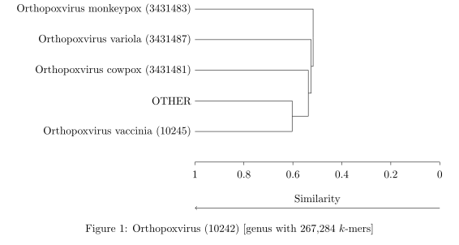
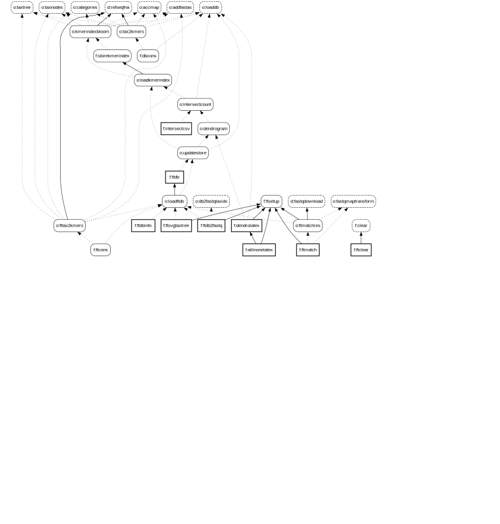

[comment]: # (“Commons Clause” License Condition v1.0)
[comment]: # ()  
[comment]: # (The Software is provided to you by the Licensor under the License,)
[comment]: # (as defined below, subject to the following condition.)
[comment]: # ()  
[comment]: # (Without limiting other conditions in the License, the grant of rights under the License)
[comment]: # (will not include, and the License does not grant to you, the right to Sell the Software.)
[comment]: # ()
[comment]: # (For purposes of the foregoing, “Sell” means practicing any or all of the rights granted)
[comment]: # (to you under the License to provide to third parties, for a fee or other consideration)
[comment]: # (including without limitation fees for hosting or consulting/ support services related to)
[comment]: # (the Software, a product or service whose value derives, entirely or substantially, from the)
[comment]: # (functionality of the Software. Any license notice or attribution required by the License)
[comment]: # (must also include this Commons Clause License Condition notice.)
[comment]: # ()
[comment]: # (Software: genestrip)
[comment]: # ()
[comment]: # (License: Apache 2.0)
[comment]: # ()
[comment]: # (Licensor: Daniel Pfeifer, daniel.pfeifer@progotec.de)

**Genestrip-FT**: Optimizing Genestrip's *k*-mer databases for accuracy on the genus level
===============================================

## Introduction

Genestrip-FT is an **extension** of [Genestrip](..), so most of its functionality is inherited from
Genestrip. Please consult [Genestrip's documentation](../README.md) before dealing with this project.

Genestrip-FT addresses a major problem
of *k*-mer databases under the genus rank: Due to the lowest common ancestor update (LCA update) for each stored *k*-mer, a *k*-mer 
is pushed to the genus already if it is shared by just two species subordinate to that genus.
As a result, a *k*-mer database's accuracy tends to descrease under the species rank when used for metagenomic analysis given that the collection
of genomes used for the LCA update is large. The effect has been studied in detail in [this research publication](https://link.springer.com/article/10.1186/s13059-018-1554-6).

Genestrip-FT addresses this problem by *refining the NCBI's [taxonomy tree](https://www.ncbi.nlm.nih.gov/taxonomy/)* as included in a Genestrip database via the following steps:
1) Based on the goal `kmerindexbloom`: Genestrip-FT performs an analysis for each *k*-mer stored right under the genus rank in order to determine from which species it was pushed up as part of the
LCA update that happened when the database was built. 
2) Based on the goal `intersectcount`: After collecting statistics on all related *k*-mers it computes a degree of intersection between
any two species that belong to the same genus using the Jaccard-index. The intersection is computed via the number
of joint *k*-mers between such two species as stored right under the genus rank.
3) Based on the goal `dendrogram`: The Jaccard-indices of any two species under the same genus form a symmetric real-valued matrix. The matrix entries constitute a pair-wise similarity measure that aids in computing a dendrogram via agglomerative clustering
using single linkage as the cluster distance. 
4) Based on the goal `updatestore`: The tree represented by the dendrogram is used
to refine the actual taxonomy tree as stored along with the database. In addition, the *k*-mers originally assigned to 
the genus are pushed down to their according, newly included nodes in the refined taxonomy tree.
5) Based on the goal `ftdb`: Finally, the reworked Genestrip database gets stored and can then be used for improved metagenomic analysis.

The default ranks for the refinement of the taxanomy tree are `genus`, `subgenus` and `species group` but other ranks can be set via a [configuration parameter](ConfigParams.md).
In addition, refinement can be enforced for specific tax ids as well.

### Generating and optimizing the sample database

After [building Genestrip](../README.md#building-and-installing), you may call
`sh ./bin/genestrip.sh human_virus ftdbinfo`
in order to generate the basic *and the optimized* `human_virus` database and create CSV files with information on their content.
The optimized database file `human_virus_ftdb.zip` will be stored under `./data/projects/human_virus/db` and 
the respective CSV file `human_virus_ftdbinfo.csv` will be stored under `./data/projects/virus/csv`

When comparing the CSV file `human_virus_dbinfo.csv` with the optimized database's info file `human_virus_ftdbinfo.csv`, you will
notice additional entries reflecting the refined taxonomy under genus rank.
E.g., when comparing the two files, the following entries changed from
```
387;9;Orthopoxvirus;genus;10242;267284;
388;10;Orthopoxvirus vaccinia;species;10245;37726;
389;11;Horsepox virus;no rank;397342;39804;
390;10;Orthopoxvirus cowpox;species;3431481;0;
391;11;Cowpox virus;no rank;10243;70054;
392;10;Orthopoxvirus monkeypox;species;3431483;0;
393;11;Monkeypox virus;no rank;10244;86029;
394;10;Orthopoxvirus variola;species;3431487;0;
395;11;Variola virus;no rank;10255;59611;
...
```
to
```
432;15;Orthopoxvirus;genus;10242;144386;
433;16;10245/.../3431487;no rank;000163;62029;
434;17;10245/.../3431481;no rank;000164;42172;
435;18;10245/OTHER;no rank;000165;18697;
436;19;Orthopoxvirus vaccinia;species;10245;37726;
437;20;Horsepox virus;no rank;397342;39804;
438;20;OTHER;no rank;00035;0;
439;19;OTHER;no rank;000166;0;
440;18;Orthopoxvirus cowpox;species;3431481;0;
441;19;Cowpox virus;no rank;10243;70054;
442;17;Orthopoxvirus variola;species;3431487;0;
443;18;Variola virus;no rank;10255;59611;
444;16;Orthopoxvirus monkeypox;species;3431483;0;
445;17;Monkeypox virus;no rank;10244;86029;
446;15;OTHER;no rank;0003;0;
...
```
This indicates that additional artificial tree nodes were created and *k*-mers
from taxid `10242` were pushed down for example to the artifical tax id `000163`
that holds the original two children with the tax ids `3431487` and `397342` as ancestors.

## Examining intermediate results

The counts for *k*-mer intersections and the associated matrix with the Jaccard-indices from step 2 from above can be written
to a CSV file via the goal `intersectcsv`. A separate CSV file will be written for each affected genus.
The corresponding files will be saved under `<base dir>/projects/<project_name>/csv` following the
pattern `<project_name>_intersectcsv_<genus_tax_id>.csv`.

Similarly, dendrograms from step 3 from above can be exported as LaTeX extracts via the goal `dendrolatex`.
A separate file will be written for each affected genus.
The corresponding files will be saved under `<base dir>/projects/<project_name>/latex` following the
pattern `<project_name>_dendrolatex_<genus_tax_id>.txt`. 
A corresponding extract is meant to be embedded in a [LaTeX](https://www.latex-project.org/) document and requires the LaTeX package [TikZ](https://github.com/pgf-tikz/pgf).

You may apply the two goals to the included sample project `human_virus` via
`sh ./bin/genestrip.sh human_virus intersectcsv dendrolatex`. This generates over 94 LaTeX extract files
in total for various viral ranks (but also the CSV files with counts for *k*-mer intersections).
E.g., the following dendrogram was produced via a corresponding file `virus_dendrolatex_10242.tex`:
<p align="center">
  
</p>

The following dendrogram results from applying the goal `dendrolatex` to the Genestrip project `borrelia` from [Genestrip-DB](https://github.com/pfeiferd/genestrip-db/).
As it is based on the *k*-mers shared between any two species under the genus Borreliella, it forms a phylogenetic tree.
Indeed, the tree's structure is very similar to [the phylogenetic tree for Borreliella established by current research](https://doi.org/10.3390/life13040972).
<p align="center">
  
</p>


## License

[Genestrip-FT is under the same license as Genestrip itself.](../LICENSE.txt) Please contact [daniel.pfeifer@progotec.de](mailto:daniel.pfeifer@progotec.de) if you are interested in a commercial license.

## Technical documentation

### Usage and goals

The usage of Genestrip-FT is [the same as for Genestrip](../README.md).

### Additional goals

[**This is a list of all goals**](Goals.md)
[in addition to the ones from Genestrip](../Goals.md).

The extended goal graph is shown below. Dashed boxes are goals inherited from Genestrip -
so this is where Genestrip-FT (also) relies on Genestrip's respective implementations.
Please keep in mind that the entire graph is a union of the graph from below and [Genstrip's original goal graph](../GoalGraph.svg).

<p align="center">
  
</p>

### Additional configuration parameters

[**This is a list of all configuration parameters**](ConfigParams.md)
[in addition to the ones from Genestrip](../ConfigParams.md).